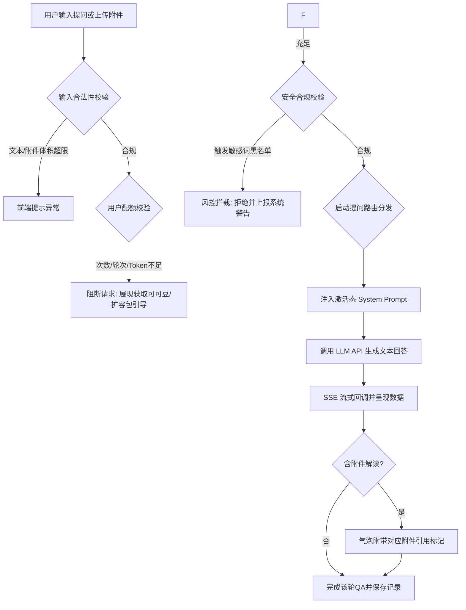

# ReliHub 产品需求文档 - MVP 爱问模块

---

## 文档元信息

| 项目 | 内容 |
|------|------|
| 文档名称 | ReliHub 产品需求文档 - MVP 爱问模块 |
| 文档版本 | V1.1 |
| 创建日期 | 2026-03-21 |
| 作者 | 产品团队 |
| 适用范围 | ReliHub MVP 阶段 (Phase 1) |
| 文档状态 | 正式版 (Sealed for MVP) |

### 变更记录

| 版本 | 日期 | 修订人 | 修订内容 |
|------|------|--------|----------|
| V1.0 | 2026-03-21 | 产品团队 | 初始版本创建 |
| V1.1 | 2026-03-28 | 产品团队 | **全量对齐审计版**：同步 LLM 通用知识回答逻辑、TTFT 性能指标及历史会话动态限额。 |

---

## 一、模块概述

### 1.1 模块定位
爱问(ReliBot)模块是 ReliHub 平台的电子产品可靠性领域专业AI助手，旨在基于LLM通用知识提供回答（Phase 3 扩展RAG专业知识库），实现 7×24 小时可靠性领域问答服务。

### 1.2 目标用户与核心诉求
- **游客用户**：无门槛体验基础打字问答，验证解答准确性。
- **注册用户**：获取电子元器件选型、全链路降额设计、失效分析等垂直类解答；上传附件进行深度结构化分析。
- **平台管理员**：切换大模型通道、设置敏感词边界库，监测和控制接口调用成本及舆情合规风险。

### 1.3 MVP阶段包含范围与边界
- **S0级必备项**：基础文字多轮流式对话、**System Prompt人设注入**、领域问题防越界保护、附件上传能力（M1-F007）、历史会话保存与列表基础能力（M1-F001/M1-F015）。
- **S1级扩展能力**：附件上传入口交互（M1-F004）、附件智能读取解读（M1-F011）、对话超限预警（M1-F013）、历史搜索与删除管理（M1-F016/M1-F017）、对话详情操作（M1-F020）、标题自动生成（M1-F012）。
- **S2级完善项**：上部内容区（M1-F005）、历史会话重命名（M1-F018）。
- **不包含（不在 Phase 1）**：智能推荐系统站内资源（P2，对应产品功能清单 M1-F021）、社区@AI唤起（P2）、语音输入（P3）。

---

## 二、业务流程与架构

### 2.1 核心业务链路流转图

### 2.2 移动端信息架构与页面结构
本项目界面需向微信小程序架构演进，页面排布采取**窄版移动端约束规范**：
- **主要视觉**：全屏自下而上滚动的气泡聊天流交互。
- **底部面板**：固定输入框与附加组件（附件上传动作区）。
- **上部内容区（M1-F005）**：对话主界面顶部预留固定的一行横幅滚动通知区，用于展示系统介绍、管理员发布的公告或广告位切换（MVP阶段默认展示系统欢迎文案）。
- **历史记录容器**：采用“**顶部入口下拉划出抽屉 (Drawer)**”或“**点击跳转至独立二级页**”展示，不使用 PC 端多栏并排布局。

### 2.3 深度链接协议 (Deep Linking)
- **协议方案**：`relihub://ai/chat?id={session_id}`
- **业务场景**：支持从【通知中心】、外部分享卡片直接唤起指定 AI 历史会话。
- **参数约束**：若 `session_id` 为空或非法，前端应默认开启一个“新会话”并 Toast 提示“会话不存在，已为您开启新对话”。

---

## 三、全局规则设计

### 3.1 权限与配额单一真源机制
> **规则声明**：本模块关于【每日新会话上限、每日问答总轮次上限、单会话轮次上限、单会话输出Token上限、单会话总Token上限、每日Token消耗总额、累计Token消耗总额、可上传附件数、单附件最大容量、总保存历史会话数量、历史会话保存空间容量】的量化阈值，均须**统一读取《PRD_可可豆与信誉分体系》§4.1.2 的配置映射，不得在前端或后端硬编码固定阈值。**

- **游客限制规则**：游客默认每日可发起 3 个新会话。游客的会话历史记录仅基于临时虚拟 ID 保存至 **Redis 临时缓存 (TTL=24h)** 中，**一旦退出系统、关闭页面或超过 24 小时未操作，临时历史对话记录将被彻底粉碎清空**，不作服务端持久化（区别于注册用户的持久化上限拦截）。**明确规定游客不享有附件上传与附件解读权限，也不开放多模态模型访问权限**。

### 3.2 计费与抵扣逻辑规则
当注册用户遇到免费额度耗尽且确认购买扩充包时（事件触发后）：
1. 系统检查用户账户**福利豆（赠送豆）**余额。
2. 若福利豆余额充足，直接全款扣除福利豆；
3. 若福利豆不足，优先将福利豆扣至0，剩余需支付差价部分，转自**金可可（资产豆）**余额中等额扣除；
4. 若福利豆与金可可总和依旧低于支付标价，终止支付线程，重定向引导至“获取可可豆/扩容包引导（注：若充值模块 MVP 未上线则当前自动隐藏现金直冲入口）”。
> **规则对齐说明**：如本节与《PRD_可可豆与信誉分体系》最终版本存在冲突，统一以可可豆体系文档的最终版本为准，并同步修订本模块。

### 3.3 内容安全与行为规范约束
- **涉政违规拦截**：严格执行双轨（前后端）敏感词查验拦截。若命中，终止网络请求，页面直接暴露并渲染红字警告阻断。
- **专业领域答复围栏**：设定强制 System Prompt，当侦测到娱乐、美食、医疗等非电子可靠性工程范畴的随意提问，大模型必须执行**礼貌拒绝**（如：“抱歉，您的问题似乎超出了电子产品可靠性的范畴。如果您有测试、失效分析等方面的问题我很乐意效劳...”），禁止生成训斥或生硬掐断的对话。

---

## 四、功能详细说明 (执行验收基线)

### 4.1 AI对话核心主流程

**【M1-F006 / F008】 多轮文字流式交互**
- **前置条件**：账户对应等级配额（本轮次 / 每日总会话 / 每日问答总轮次 / Token剩余）＞ 0，且不含敏感词。
- **主流程**：点击底部输入框输入文本并发送 -> 输入框失焦清空 -> 用户消息在右侧气泡渲染 -> 会话区自动滚动到底部 -> 后端通过 Server-Sent Events (SSE) 返回流式内容 -> 前端完成 Markdown 渲染。
- **快捷新对话按钮**：页面提供"新对话"图标（位于顶部导航栏或输入框附近）。点击后先自动保存当前对话（标题与所有问答记录）后直接返回爱问主页/历史列表页。新对话图标在正在输入时点击应二次确认是否放弃当前输入。
- **异常流程**：1. 回车发送时字符串超 2000 字符上限 -> 前端展示 Toast "输入文本超出最大字符限制"；2. 接口 30 秒内未返回首字 -> 显示"[网络连接超时，请重试]"气泡组件。
- **埋点**：上报 `ai_chat_send_text`。
- **验收口径**：首字送达延时不超过 1 秒；支持顺滑展示复杂 Markdown 嵌套语法（无序列表、表格、行内代码）且无错位乱码；遇到 30 秒响应瓶颈时执行精确的重试熔断机制；新对话按钮点击后当前对话自动保存且正确返回列表页。

**【M1-F020】 对话详情操作 (S1, 气泡反馈组件)**
- **前置条件**：AI 返回完整的气泡回复闭环之后。
- **主流程**：
  1. 在每个 AI 侧气泡框底部外挂五个轻量图标控件：【点赞】、【点踩】、【复制】、【分享】、【删除本条】。
  2. 点击制式操作（点赞/点踩）-> 图标亮起，禁用互斥状态（踩赞互斥）；点击"复制"-> 提取 Markdown 原文本推入粘贴板并 Toast 提示成功；支持用户长按气泡内容自定义选取文字后点击"复制"图标，将选取的文字推入粘贴板。
  3. 点击"分享"-> 系统生成包含当前对话内容的平台水印长图（包含平台 Logo 与发布者昵称），调起端侧原生分享组件。
  4. 点击“删除本条”-> 触发二次确认弹窗“确定删除本轮问答吗？”。确认后，前端隐藏该气泡，并在后台写入软删除标记。
- **埋点**：上报 `ai_chat_bubble_like` / `ai_chat_bubble_dislike`。
- **计费规则**：软删除仅影响展示，不退还已消耗的轮次与 Token。
- **验收口径**：点赞/踩动作结果须落库统计验证双态互斥；软删除后的内容不应在用户退出重进该历史记录后再次出现；分享生图组件必须截取清晰且版式正常无堆叠黑块。

**【M1-F004】 附件上传入口 (S1)**
- **前置条件**：页面处于可输入状态。
- **主流程**：在底部输入框左侧固定展示"+"上传图标。点击后弹出动作面板（拍照、从相册选择、从文件选择、微信文件）；选择后进入文件校验与上传流程。
- **微信文件来源说明**：微信文件指用户通过微信聊天窗口直接选择已有的文件（PDF/Word/Excel/PPT/图片等），无需从手机本地重新上传。
- **状态规则**：游客、额度耗尽、网络不可用时保留入口但置灰，点击后弹出原因提示；注册用户且额度充足时入口可点。
- **验收口径**：入口位置固定、交互反馈一致；置灰态不可触发系统文件选择器。

### 4.2 附件上传(S0)与附件解读(S1)

**【M1-F007】 附件上传 (S0)**
- **前置条件**：用户非游客且具有附件使用额度。
- **主流程**：点击上传入口 -> 选择资源 -> 校验后缀与大小 -> 异步上传至 OSS -> 返回对象 URL -> 在输入框上方展示缩略卡片与文件名。
- **格式与大小规则**：支持格式与大小均由管理后台统一配置（管理员需超级管理员授权）。默认白名单：txt、doc、docx、pdf、xls、xlsx、ppt、pptx、PNG、JPG、JPEG、BMP、TIF、TIFF、GIF、WebP（对齐《PRD_MVP_文件与附件处理规范.md》）。
- **数量规则**：需同时校验“单次附件上传数量上限”与“累计可上传附件数量上限”，两项阈值均以用户当前等级配置为准。
- **异常流程**：上送体积 > 本等级最大附件阈值时不执行上传，提示“文件超限”；后缀不在白名单时提示“不支持该格式”；当次上传数超过上限时提示“单次上传数量超限”；累计上传数量超过上限时提示“累计附件数量超限，请清理后再试”。
- **埋点**：上报 `ai_upload_attachment` (参数: `file_extension`, `size`)。
- **验收口径**：上传前校验在客户端完成；通过校验后才允许上传；上传成功后可见缩略卡片。

**【M1-F011】 附件解读 (S1)**
- **前置条件**：已上传至少 1 个附件且用户具备附件解读额度。
- **主流程**：附件与文本联合提交给多模态模型进行解读，按 SSE 流式返回结果。
- **成本预检**：提交前先执行等效 Token 成本预估。若预测成本超过用户当前可用 Token/可可豆阈值，则拒绝启动解读并返回引导。
- **费用归属**：附件解读产生的模型成本统一计入会话 Token 计费池，不单独建立费用账本。
- **引用标记 (Citations)**：AI 基于附件回答时，气泡底部需显示“依据：[附件文件名]”；若涉及多个附件，按引用颗粒度标记，点击标记可定位至输入框上的对应缩略图。
- **异常流程**：解析超过 60 秒时中断并提示“文件解析超时，请拆分后重试”。
- **验收口径**：附件解读首字响应 ≤ 5 秒，完整解读完成 ≤ 60 秒。

### 4.3 历史对话管理重组

**【M1-F001】 下拉抽屉式历史记录与切换**
- **主流程**：用户点击顶部导航主标题右侧锚点 -> 遮罩并向下展开满视图 Drawer 抽屉列表。列表中按生成修改的时间戳进行降序（新->旧）排版并保留最近对话节点时间。
- **异常流程**：当前会话库中的储存条目总数触达上限，或历史会话落盘总容量(MB)触达上限（双阈值任一命中）时，点击“创建新会话”将被阻断，并弹出提示：“历史云端存储已满，请手动清理不必要会话或使用可可豆扩容。”
- **容量策略**：Phase 1 采用硬阻断策略，不自动覆盖最早对话；Phase 2 可配置“自动覆盖最早对话”开关，默认关闭。

**【M1-F019】 继续历史对话 (S0级复原)**
- **前置条件**：于抽屉列表中点选一则非违规删除的历史记录标名。
- **主流程**：点击目标历史记录后回到对应会话上下文，系统拉取该会话历史消息并展示，用户可继续在输入框发起提问。
- **异常流程**：当目标会话已达到单会话轮次上限（例如 20 轮）时，输入框置灰并提示：“该会话已达到轮次上限，请新建会话继续提问。”

**【M1-F012】 对话标题智能摘要 (S1)**
- **主流程**：用户会话完成首轮有效问答后，后端异步调用 LLM 生成 4~8 字摘要标题并回传前端刷新展示。
- **验收口径**：当标题生成失败时返回保底默认词“新会话-MMDD”。

**【M1-F018】 历史会话重命名 (S2)**
- **主流程**：用户在历史记录列表左滑选择“重命名”，唤起输入框后保存自定义标题。
- **验收口径**：人工命名优先级高于自动摘要标题。

**【M1-F017】 历史会话删除动作 (含单条与批量)**
- **前置条件**：打开抽屉展示已记录在案的会话矩阵。
- **主流程**：
  1. 单条删除：对单一卡片进行左滑长按，呼出【删除】红色色块点击触发。
  2. 批量删除：提供右上角“管理”入口，切换多选组件勾选多项，批量删除操作。
- **异常流程**：必须加有一道防误触的二次确认弹窗。
- **权限与验收口径**：游客不展示该功能（游客无跨端持久化历史）。删除后后台需同步清理关联附件（物理删除或软删除策略按存储规则执行），释放对应配额。

**【M1-F013】 对话超限预警 (S1)**
- **触发条件**：单会话轮次与每日问答总轮次采用固定阈值（默认剩余 3 轮触发）；Token、历史会话容量、附件额度采用比例阈值（默认达到上限 80% 触发），阈值均可配置。
- **提示时机**：用户发送前实时检查；发送成功后再次校验并展示最新剩余额度。
- **展示形式**：输入框上方提示条 + Toast；达到上限时升级为阻断弹窗并给出“去清理/去扩容”操作入口。
- **验收口径**：预警与阻断不冲突；同一会话同一指标 10 分钟内去重提示。

**【M1-F016】 对话搜索 (S1)**
- **前置条件**：用户已进入历史记录抽屉或历史记录二级页。
- **主流程**：支持按关键词和日期区间检索历史会话标题与内容摘要；结果按最近更新时间倒序展示。
- **异常流程**：无结果时展示空状态与“清空筛选”快捷操作。
- **性能要求**：在 30 条历史记录规模下，搜索结果返回 ≤ 1 秒。

---

## 五、错误码对接技术矩阵

本章节汇整提供前后端准确对接的错误码（Error Code）表述及干预规范标准：

| 异常业务场景 | 错误码 (Error_Code) | HTTP_Status | 重试许可项 | 前端呈示用户提示标准文案 | 后方控制拦截动作执行行为分水线 | 第一权责分配网域 |
|---------|-----------------------|-------------|-------------|-------------|-------------|-------------|
| **配额超限拦截** | `QUOTA_EXHAUSTED` | 403 | 否 (需补给) | “配额不足，请获取可可豆或使用扩容包后重试。” | 阻断本次请求并返回扩容引导，不进入模型调用链路。 | 可可豆域联动 / 前端 |
| **存储超限拦截** | `HISTORY_CAPACITY_FULL` | 403 | 否 (需清理) | “历史记录数量或存储容量已达上限，请先清理后再创建新会话。” | 阻断新建会话并引导进入历史记录管理。 | 会话域流 / 前端 |
| **内容安全碰撞** | `SENSITIVE_TEXT_BLOCK` | 400 | 否 (需修改) | “内容包含敏感词，请修改后重试。” | 阻断提交并保留输入内容，同时记录安全日志。 | AI安全盾 / 后端 |
| **附件格式或大小不支持** | `ATTACHMENT_UNSUPPORTED` | 415 | 否 (需更换文件) | “文件格式不支持或文件大小超限，请更换后重试。” | 阻断上传与解析流程，不进入模型调用。 | 服务网关端 / 后端 |
| **多模态成本超限** | `ATTACHMENT_COST_EXCEEDED` | 403 | 否 (需补给) | “当前附件预计消耗超出可用额度，请减少附件数量/大小或先补充可可豆后重试。” | 在模型调用前执行成本预检并阻断请求，返回额度引导。 | 计费域联动 / 后端 |
| **网关超时** | `GATEWAY_TIMED_OUT` | 504 | 是 (可重试) | “网络连接超时，请检查网络后重试。” | 中断当前流式连接，保留重试入口。 | 网络网关节点 / 运维 |

---

## 六、全局配置矩阵管控（管理后台配置参数）

以下参数统一在系统管理后台配置并下发（**所有配置变更需经超级管理员授权后生效**）。

### 6.1 等级相关配置 (承接权限校验映射)
动态配置项（映射用户等级）：
- `AI_Daily_Session_Limit`：每日准入总局数上限。
- `AI_Daily_Total_Turn_Limit`：每日问答总轮次上限。
- `AI_Turn_Limit_Per_Session`：单次会话最大轮次。
- `History_Session_Count_Limit`：历史会话保存个数上限。
- `History_Storage_MB_Limit`：历史会话保存空间容量上限（MB）。
- `Token_Output_Limit_Per_Session`：单个对话输出Token上限，后端需用于映射大模型`max_tokens`。
- `Token_Total_Limit_Per_Session`：单个对话总Token上限，作为单局累计熔断阈值。
- `Token_Daily_Consume_Limit`：每日Token消耗总额上限，作为按天成本熔断阈值。
- `Token_Lifetime_Consume_Limit`：累计Token消耗总额上限，作为账户级成本熔断阈值。
- `Attachment_Number_Per_Request`：单次附件上传数量上限。
- `Attachment_Number_Total`：累计可上传附件数量上限。
- `Attachment_File_MB_Limit`：单文件大小上限（MB）。

### 6.2 系统与安全级策略配置
- `LLM_API_Key` / `Base_URL`：大模型 API Key 配置，需支持动态热更新（例如可直切至 DeepSeek、GPT 等模型服务通道）。
- `System_Prompt_Activation`：系统提示词激活策略。**版本化生效规则**：后台更新并“发布”新版本 System Prompt 后（仅超级管理员具权），仅对**发布时刻之后创建的新会话**生效；已有历史会话继续沿用创建时的 Prompt 快照或支持按会话 ID 锁定旧版快照回滚。
- `RAG_Knowledge_Index` **[Phase 3]**：主权专属的向量知识检索总表关联标识码，Phase 3 RAG上线后启用。
- `Sensitive_Words_Blacklist`：网关层敏感词黑名单配置。

---

## 七、跨模块接口边界 (API 契约梳理)

### 7.1 与【可可豆体系】对接接口
- **额度查询请求**：模块调用接口实时查询金可可与福利豆余额。
- **计费扣减请求**：用户发生扩容事件时调用，提交扣减请求；可可豆中心返回交易结果或 `Insufficient_Balance`（余额不足）。

### 7.2 与【通知模块】对接风控告警
- **高风险告警推送**：当系统判定用户在短时间内高频触发敏感词拦截（例如 1 日 > 3 次）时，向通知模块发送 `Push_Warning_Notice_Event`；通知模块通过系统通知、消息列表或弹窗进行告警展示。

### 7.3 与【管理后台】对接指标推送
- 爱问模块需上报 `daily_new_sessions`（每日新会话数）、`total_token_consume`（Token 消耗总量）、`security_block_count`（安全拦截次数）等脱敏统计指标，用于管理后台监控展示。

---

## 八、界面视觉与适配响应设计规范

界面按**移动优先与单轴布局**原则设计：
- **宽屏适配约束**：在宽屏 Web 场景不启用左侧常驻列表 + 右侧主内容的双栏布局，保持单列主内容区；附加功能使用上/下浮层呈现。

---

## 九、非功能核心验收与数据要求

### 9.1 性能与稳定性要求单项准出基线表
本系统采用长连接异步通信模式，发布前需满足以下性能门槛：

| 监控验收指标监控项 | 期望性能目标 (P95) | 发版阻断阈值 (P99) | 采样环境矩阵与排除条件 | 采样口径/统计窗口门槛 | 测试与验收对齐工具 |
|---------|-----------------------|-------------|-------------|-------------|-------------|
| **文本首字送达延时 (TTFT)** | **≤ 1.0 秒**。  对齐非功能需求。>3秒标记为弱网体验。 | **> 3秒 判定为体验降级（非发版阻断项）** | 网络：4G及以上WiFi；机型：iPhone 11水平及以上的端侧响应速度。排除用户主动取消请求样本。 | 客户端发送点击至收到首个 SSE Chunk 耗时（首字符时间）。单日最小压测并发样本量>1000。 | 端到端自动化压测脚本 |
| **文本问答网关超时熔断** | **≤ 30 秒内完成首字返回** | **> 30秒 必须强制切断并返回超时报错** | 同文本TTFT采样环境。 | 以请求发起到超时熔断触发时刻统计。与TTFT口径独立。 | 网关超时监控与压测回放 |
| **文本单轮问答完成时间** | **≤ 30 秒** | **> 30秒 强制终止并记为失败** | 同文本TTFT采样环境。 | 从用户发送至AI完整回复（纯LLM生成，Phase 3扩展RAG）耗时。单版本并发样本>500。 | 全链路压测探针 |
| **流式输出速度** | **≥ 5 字/秒** | **< 3字/秒 阻断发版** | 同文本TTFT采样环境，剔除首字等待时段。 | 统计SSE Chunk持续推送期间每秒输出字符数均值。 | 端到端自动化压测脚本 |
| **历史对话列表加载** | **≤ 1 秒** | **> 2 秒 需优化** | 网络：4G及以上WiFi；加载30条历史对话数据。 | 从点击入口至列表完整渲染耗时。单版本并发样本>500。 | Jmeter 列表接口探针 |
| **历史对话详情加载** | **≤ 500 ms** | **> 1 秒 需优化** | 网络：4G及以上WiFi；加载单个对话完整气泡流。 | 从点击记录至上下文快照完整渲染耗时。单版本并发样本>500。 | Jmeter 详情接口探针 |
| **附件解析首馈迟滞** | **≤ 5.0 秒** | **> 60秒 强制判为超时终止本轮** | 同上方文字基准，网络强要求高速畅通传输 WiFi 环境。 | 附件上传解析至大模型首字返回耗时。单版本并发样本>500。| Jmeter 并发探针 |
| **SSE 推流异常掉断率** | **≤ 0.1%** | **> 0.5% 阻断发版** | 必须横向排除用户主动切断退出的干扰事件。| 发版前全周期服务端累计测算汇总，无起步基准样本限制要求。| Nginx / 长连接异常日志监控 |

### 9.2 全局核心业务交互数据埋点规范（必填参数字典）
为防止数据中台统计查询时导致口径失准或分叉，在此锁定下列标准化核心埋点行为及传参探针体系：

| 埋点操作事件层标识符 (Event_ID) | 触发交互记录特定场景说明 | 必填核心参数字典明细项 (Params_Require) | 审计与下游运营分析实际用途 |
|---------------------|----------------|----------------|----------------|
| `ai_chat_send_text` | 用户提交文本提问时触发 | `is_visitor` (布尔型, 是否游客)   `char_length` (整型, 提交字符数)   `token_estimate` (整型, 预估 Token 数)   `session_id` (字符型, 对话唯一标识) | 用于统计会话使用量与算力消耗。 |
| `ai_upload_attachment` | 附件上传流程完成时触发 | `file_extension` (字符型, 文件后缀)   `obj_size` (整型, 文件字节数)   `is_upload_success` (布尔, 是否成功) | 用于统计附件格式分布与上传成功率。 |
| `ai_chat_bubble_like` | 用户点击【点赞】时触发 | `session_id` `message_id` (字符型, 消息ID) | 用于识别高质量回答样本。 |
| `ai_chat_bubble_dislike`| 用户点击【点踩】时触发 | `session_id` `message_id` `bad_tag` (选填, 跑题/格式异常等) | 用于分析低质量回答原因并优化模型。 |
| `ai_sys_blocked` | 触发配额或安全拦截时触发 | `block_type_reason` (枚举: limit_quota, black_security_word, super_size)   `user_badge_level` (字符型, 用户等级) | 用于评估拦截策略有效性。 |

---

## 十、关联跨体系基石图纸索引单名汇编

### 10.1 前置根基输入与全局纲领源
- [ReliHub 总体方案PRD](../02_总体方案PRD/PRD_总体方案_V1.1.md) (平台总系统框架顶层依赖)
- [ReliHub 术语表](../02_总体方案PRD/PRD_术语表.md) (模块用词统一映射表)
- [ReliHub MVP 总体说明](./PRD_MVP_总体说明.md) (限定本 MVP 项目周期的最小能力上线底界划段指南)
- [ReliHub 产品功能清单](../02_总体方案PRD/PRD_产品功能清单.md) (归口功能边界清单总索引)

### 10.2 核心专项约束与联动依据
- [ReliHub AI助手行为规范](../02_总体方案PRD/PRD_AI助手行为规范.md)：定义系统提示词边界、拒答范围与礼貌拒绝策略。System Prompt 管理入口见管理后台 §5.5 (含版本管理与回滚, 仅限超级管理员)。
- [ReliHub 可可豆与信誉分体系](../02_总体方案PRD/PRD_可可豆与信誉分体系.md)：定义配额、阈值与可可豆核销规则，作为本模块统一配置来源。

---

*（文档最终编撰核完确认结束标识）*
